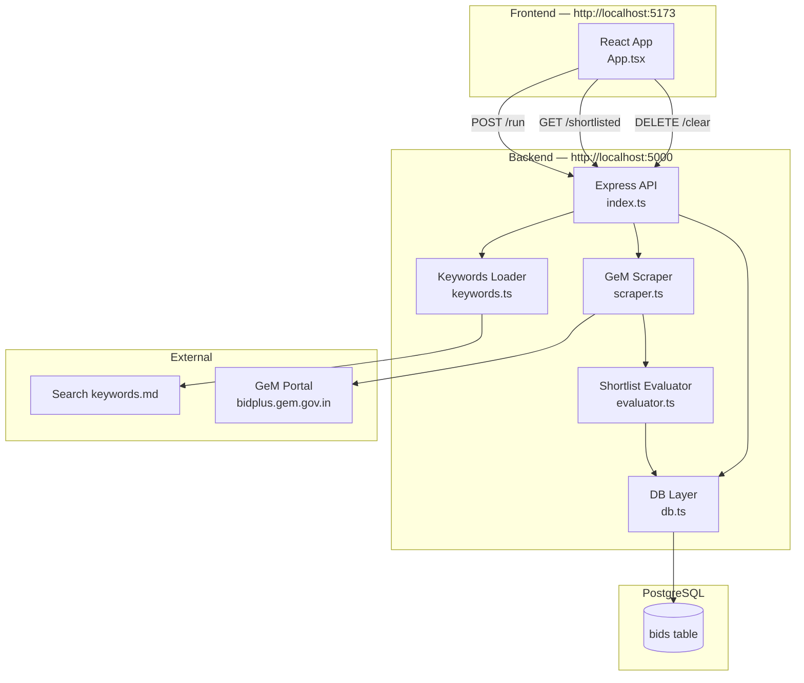
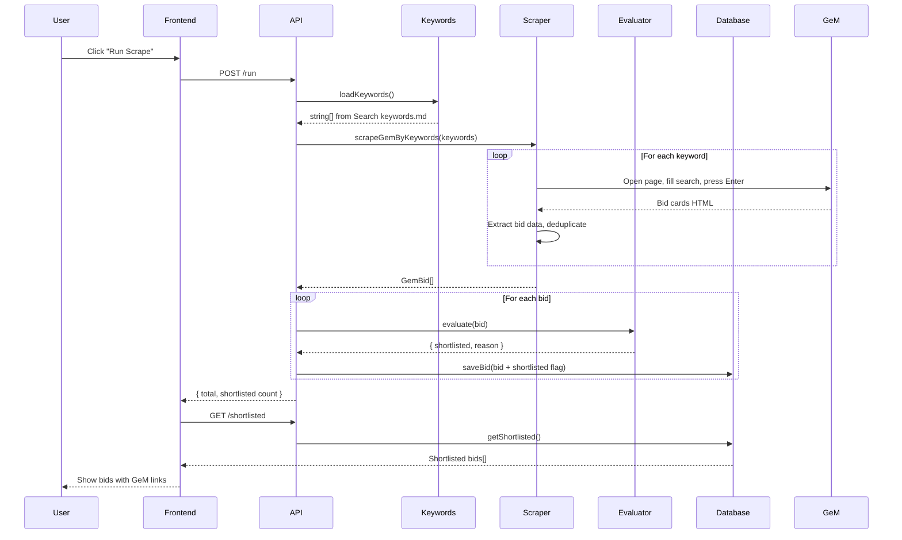
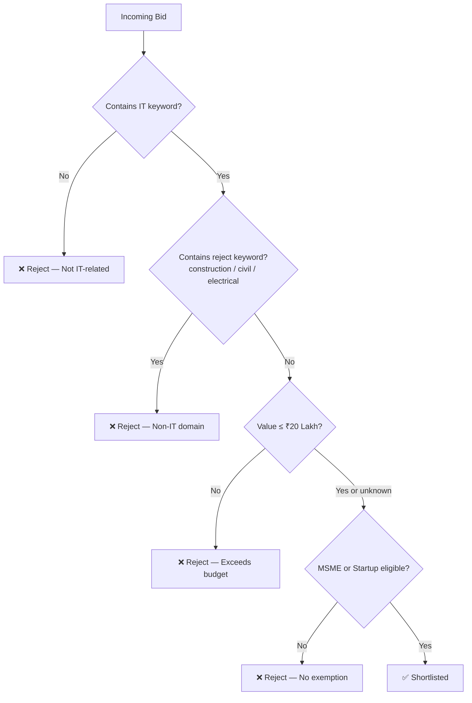

# TenderIQ — Architecture & System Design

Simple, direct procurement scraper engine. Searches GeM by keyword, evaluates bids, stores results.

---

## 1. System Architecture



---

## 2. Request Flow — Run Scrape



---

## 3. Shortlist Evaluation Logic



---

## 4. File Structure

```
scraper/
├── setup.sh                    # Start everything
├── Search keywords.md          # (inside backend/) Your keyword list
│
├── backend/
│   ├── .env                    # 4 lines: NODE_ENV, PORT, FRONTEND_URL, DATABASE_URL
│   ├── package.json
│   └── src/
│       ├── index.ts            # Express server — 3 routes
│       ├── scraper.ts          # Playwright → GeM search
│       ├── evaluator.ts        # Shortlist criteria checker
│       ├── db.ts               # Save / get / clear bids
│       └── keywords.ts         # Reads Search keywords.md
│
├── frontend/
│   └── src/
│       ├── App.tsx             # Single page UI
│       ├── index.css           # Dark UI styles
│       └── main.tsx            # Entry point
│
└── database/
    └── prisma/
        └── schema.prisma       # Single "bids" table
```

---

## 5. Database Schema

```mermaid
erDiagram
    BIDS {
        uuid    id          PK
        string  bidId       UNIQUE
        string  title
        string  organisation
        string  gemUrl
        float   value       "nullable"
        string  closingDate "nullable"
        bool    isMsme
        bool    isStartup
        string  keyword
        string  docText     "nullable"
        bool    shortlisted
        datetime createdAt
    }
```

---

## 6. API Endpoints

| Method | Route | What it does |
|--------|-------|--------------|
| `POST` | `/run` | Search GeM with all keywords, evaluate, save results |
| `GET` | `/shortlisted` | Return all bids that passed shortlist criteria |
| `DELETE` | `/clear` | Wipe all saved bids from the database |

---

## 7. Shortlist Criteria

| Criteria | Rule |
|----------|------|
| IT-related | Title must contain: software, web, mobile, app, portal, dashboard, AI, MIS, CRM, cloud, SaaS, etc. |
| Value cap | ≤ ₹20 Lakh (if value is known) |
| MSME / Startup | Must have MSME or Startup exemption mentioned |
| Reject keywords | Rejects if title contains: construction, civil, electrical, supply of, furniture, printing, catering, manpower, housekeeping |
